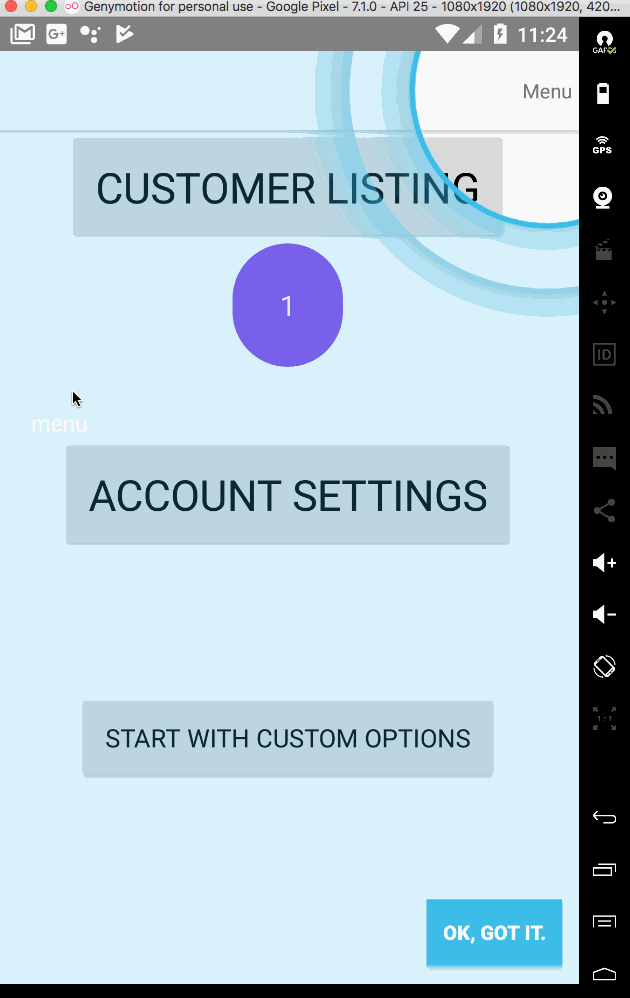

**NOTE:** Plugin source has been moved [here]([nativescript-coachmarks](https://github.com/nstudio/nativescript-ui-kit/tree/main/packages/nativescript-coachmarks#readme))
<hr>
NativeScript plugin to display user coach marks utilizing shape cutouts over an existing UI. This approach leverages your actual UI as part of the onboarding process for your user.

Based on [MPCoachMarks](https://github.com/bubudrc/MPCoachMarks).

# Install

```
npm install nativescript-coachmarks --save
```

IOS |  Android
-------- | ---------
 | 
* [Usage](#usage)
* [Docs](#tnscoachmarks)

# Usage

### Android


```
import {TNSCoachMarks, TNSCoachMark} from 'nativescript-coachmarks';

// assuming page is defined
let AndroidButton = page.getViewById('my-button')
let AndroidLabel = page.getViewById('my-label');
let cm = new TNSCoachMarks();
cm.initEvents(); //If you want events

cm.events.on('click', (eventData) => {
  // clicked on item at step index: eventData.data.index
});
cm.events.on('cleanup', (eventData) => {
  // clean up any instances in your implementation
});
cm.events.on('navigate', (eventData) => {
  // navigated to index
});

let marks = [
  new TNSCoachMark({
    caption: '1. My Button.',
    view: AndroidButton
  }),
  new TNSCoachMark({
    caption: '2. My Label.',
    view: AndroidLabel
  })
];

cm.start(marks);
```


### Simple

Use static methods to show coachmarks.

```
import {TNSCoachMarks, TNSCoachMark} from 'nativescript-coachmarks';

// assuming page is defined
let iOSButton = page.getViewById('my-button').ios;
let iOSLabel = page.getViewById('my-label').ios;

let marks = [
  new TNSCoachMark({
    position: CGRectMake(
      iOSButton.frame.origin.x - 5,
      iOSButton.frame.origin.y + 20,
      iOSButton.frame.size.width + 10,
      iOSButton.frame.size.height
    ),
    caption: '1. My Button.',
    shape: TNSCoachMark.SHAPES.DEFAULT,
    labelPosition: TNSCoachMark.LABEL_POSITIONS.BOTTOM,
    labelAlignment: TNSCoachMark.LABEL_ALIGNMENTS.LEFT,
    showArrow: true
  }),
  new TNSCoachMark({
    position: CGRectMake(
      iOSLabel.frame.origin.x, 
      iOSLabel.frame.origin.y + 64, 
      iOSLabel.frame.size.width, 
      iOSLabel.frame.size.height
    ),
    caption: '2. My Label.',
    shape: TNSCoachMark.SHAPES.DEFAULT,
    labelPosition: TNSCoachMark.LABEL_POSITIONS.BOTTOM,
    labelAlignment: TNSCoachMark.LABEL_ALIGNMENTS.CENTER,
    showArrow: true
  })
];

TNSCoachMarks.start(marks);
```

### Advanced

Configure advanced options by creating an instance to listen to events and further customize coachmarks.

```
import {TNSCoachMarks, TNSCoachMark, ICoachMarkOptions} from 'nativescript-coachmarks';

// define custom options
let options: ICoachMarkOptions = {
  continueLabelText: 'Tap Screen for Next Tip',
  skipButtonText: 'Exit',
  lblSpacing: 15,
  maskColor: UIColor.colorWithRedGreenBlueAlpha(0.30, 0.46, 0.89, .9)
};

// create a TNSCoachMarks instance
let coachMarksInstance = new TNSCoachMarks();

// initialize events
coachMarksInstance.initEvents();

// wire up events

// fired each time user taps screen and advances to next step (including the first step display)
coachMarksInstance.events.on('navigate', (eventData) => {
  console.log(`navigated to index: ${eventData.data.index}`);

  // customize 'continue' label or 'skip' button
  // their style can be changed upon each step or only once on first step
  // first, grab the coachmarks instance
  let instance = eventData.data.instance;

  // wanna change the arrow image for each step?
  instance.arrowImage.image = UIImage.imageNamed('custom-arrow.png');

  if (instance.lblContinue) {
    // customize continue button
    // only available when the first step fires (disappears after first tap)
    let labelContinue = instance.lblContinue.frame;
    instance.lblContinue.frame = CGRectMake(labelContinue.origin.x, labelContinue.origin.y - 20, labelContinue.size.width, labelContinue.size.height + 20);
    instance.lblContinue.backgroundColor = new Color('#FFE108').ios; 
    
    // custom caption color
    instance.lblCaption.textColor = new Color('#FFE108').ios;

    // customize skip button
    let btnSkip = instance.btnSkipCoach.frame;
    instance.btnSkipCoach.frame = CGRectMake(btnSkip.origin.x, btnSkip.origin.y - 20, btnSkip.size.width, btnSkip.size.height + 20);
  }    
});
coachMarksInstance.events.on('click', (eventData) => {
  // clicked on item at step index: eventData.data.index
});
coachMarksInstance.events.on('cleanup', (eventData) => {
  // clean up any instances in your implementation
});

// define your marks

// assuming page is defined
let iOSButton = page.getViewById('my-button').ios;
let iOSLabel = page.getViewById('my-label').ios;

let marks = [
  new TNSCoachMark({
    position: CGRectMake(
      iOSButton.frame.origin.x - 5,
      iOSButton.frame.origin.y + 20,
      iOSButton.frame.size.width + 10,
      iOSButton.frame.size.height
    ),
    caption: '1. My Button.',
    shape: TNSCoachMark.SHAPES.DEFAULT,
    labelPosition: TNSCoachMark.LABEL_POSITIONS.BOTTOM,
    labelAlignment: TNSCoachMark.LABEL_ALIGNMENTS.LEFT,
    showArrow: true
  }),
  new TNSCoachMark({
    position: CGRectMake(
      iOSLabel.frame.origin.x, 
      iOSLabel.frame.origin.y + 64, 
      iOSLabel.frame.size.width, 
      iOSLabel.frame.size.height
    ),
    caption: '2. My Label.',
    shape: TNSCoachMark.SHAPES.DEFAULT,
    labelPosition: TNSCoachMark.LABEL_POSITIONS.BOTTOM,
    labelAlignment: TNSCoachMark.LABEL_ALIGNMENTS.CENTER,
    showArrow: true
  })
];

TNSCoachMarks.start(marks, options, coachMarksInstance);
```

## TNSCoachMarks

Used to configure and display coach marks.

#### Properties

Property |  Description
-------- | ---------
`TNSCoachMarks.APP_SETTINGS_KEY: string` | The persistence key used when saving whether your marks have been shown or not. Defaults to 'TNSCoachMarks'.
`TNSCoachMarks.DEBUG: boolean` | Turns on some helpful logging if you have trouble setting things up.
`TNSCoachMarks.CONTINUE_LOCATIONS: ICONTINUE_LOCATION` | Use with the `continueLocation` option to change position of the continue/skip bar. Supports: TOP, CENTER, BOTTOM.
`events: Observable` | Used when setting up instance events.

#### Methods

Method |  Description
-------- | ---------
`TNSCoachMarks.start(marks: Array<TNSCoachMark>, options?: ICoachMarkOptions, instance?: TNSCoachMarks): void` | Used to start the coachmarks.
`TNSCoachMarks.HAS_SHOWN(): boolean` | Whether coachmarks have been shown.
`TNSCoachMarks.PERSIST(): void` | Simply persists `true` using the `TNSCoachMarks.APP_SETTINGS_KEY`. You normally don't use this directly but is rather used internally when using the `persist` option when calling `start`.
`TNSCoachMarks.RESET(): void` | Used to clear persisted value that marks had been shown.

Options:

```
interface ICoachMarkOptions {
  enableContinueLabel?: boolean;  // true
  enableSkipButton?: boolean;     // true
  continueLabelText?: string;     // 'Tap to continue'
  skipButtonText?: string;        // 'Skip'
  animationDuration?: number;     // .3
  continueLocation?: number;      // Bottom
  lblSpacing?: number;            // 35
  cutoutRadius?: number;          // 2
  maskColor?: any;                // 0,0,0 alpha 0.9
  maxLblWidth?: number;           // 230
  persist?: boolean;              // false
}
```

## TNSCoachMark

Used to define your marks.

#### Properties

Property |  Description
-------- | ---------
`position: any` | An iOS `CGRect` position object.
`caption: string` | Your caption label text.
`shape: number` | Use `TNSCoachMark.SHAPES`. Supports: TOP, CENTER, BOTTOM.
`labelPosition: number` | Use `TNSCoachMark.LABEL_POSITIONS`. Supports: BOTTOM, LEFT, TOP, RIGHT, RIGHT_BOTTOM.
`labelAlignment: number` | Use `TNSCoachMark.LABEL_ALIGNMENTS`. Supports: CENTER, LEFT, RIGHT.
`showArrow: boolean` | Show arrow or not.
`view:View` | View to highlight . Android only

## Why the TNS prefixed name?

`TNS` stands for **T**elerik **N**ative**S**cript

iOS uses classes prefixed with `NS` (stemming from the [NeXTSTEP](https://en.wikipedia.org/wiki/NeXTSTEP) days of old):
https://developer.apple.com/library/mac/documentation/Cocoa/Reference/Foundation/Classes/NSString_Class/

To avoid confusion with iOS native classes, `TNS` is used instead.

## License

MIT
